玩转“粉丝日志”
===========

亲，不管你是通过何种途径、抱着怎样的目的、克服了多少艰难险阻、千辛万苦的找到了“[粉丝日志](http://blog.fens.me/)”，并且眼前一亮、惊为天人、拍案叫绝、相见恨晚，随即手指头犯贱，把它加入了自己的收藏夹中，那么，小编在此恭喜了，您已经奋不顾身的跳进了“[粉丝日志](http://blog.fens.me/)”这个万年深坑！！！有铁粉儿不乐意了，说这儿明明是宝藏，你干嘛非说是坑啊，你是来黑“[粉丝日志](http://blog.fens.me/)”的么？！亲，淡定，接着往下看。

至今为止，据不完全统计，“[粉丝日志](http://blog.fens.me/)”共有博文240多篇，其中涉及AngularJS、Nodejs、R、Hadoop、RHadoop、NoSQL、MongoDB、VPS、ubuntu、SEO、算法，甚至还有股票、债券、基金、逆回购等！亲，你真的都认识上面这一片名词么？知道他们之间的关系么？真的有结合“[粉丝日志](http://blog.fens.me/)”制定自己的学习路线么？遇到问题，你能快速、准确、有效的找到自己需要的文章么？你要是跟我说“能！”，那得嘞，这篇博文对你一点儿帮助都木有，直接关上吧，慢走不送。但，如果你真的正在被上述这些问题困扰，那小编我又得恭喜了，你终于人品大爆发，辗转看到我我的这篇文章，小编我很有信心的告诉你，以上这些问题，这篇文章都能帮你解决！

好吧，我也不罗里吧嗦的说其他的了，省得有人又该说我是话唠了，让我们直入主题！

#### 目录

- 一、各个“系列文章”间的关系及博客整体机构（思维导图）
- 二、如何搜索 
- 三、提问与留言

## 一、各个“系列文章”间的关系及博客整体机构（思维导图）

熟悉“[粉丝日志](http://blog.fens.me/)”的朋友们都知道，博主很贴心的在右手边添加了“站内导航”。

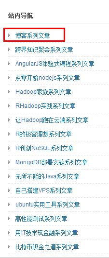

点开第一个[博客系列文章](http://blog.fens.me/series/)，可以看到博主给自己各个“系列文章”大致的分类，这个应该就是博主为自己博客做的一个总目录。

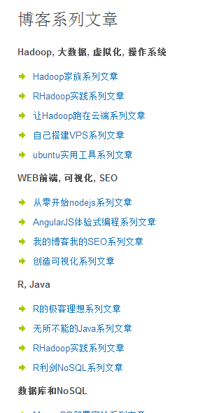

但，我必须很遗憾的告诉你，这个目录......不全！（虽然差的不是太多吧！）而且吧，结构有点儿乱。

那怎么办？！好说，就看看小编我千辛万苦、费劲巴拉、牺牲了N多脑细胞为大家总结的思维导图！

锵锵锵锵~~~~~上图！

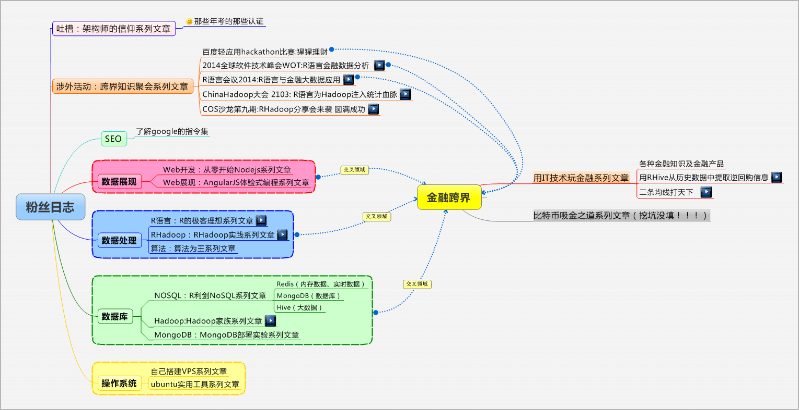

> 特别强调：
> 
- 这张图，大概涵盖了[粉丝日志](http://blog.fens.me/)70%的文章，剩下那30%，有部分是挖坑没填的，也有部分是我故意没写的，为的就是让你们能有“自己发现的乐趣”！吼吼~~~我绝不会告诉你，是我懒得写全！！！
- 图中色块的颜色、大小、文字的多少，与相应博文的难度、重要性、文章多少神马的，没有半毛钱关系！！！
- 我画这张图是在2014年9月2日，随着时间的推移，博主可能有新的系列文章的增加，请各位自行对照更新。

下面，就让我们结合这个图，整体剖析一下[粉丝日志](http://blog.fens.me/)吧！

### 1.主要涉猎领域

相信你们看到上面那图的时候，首先吸引住你们眼球的，应该就是比重最大的这四个色块了！

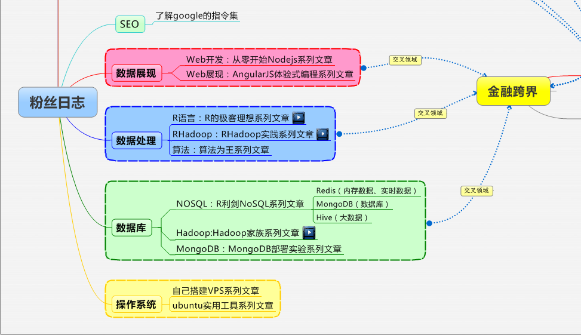

操作系统、数据库、数据处理、数据展现，没错，这四块内容，的确就是[粉丝日志](http://blog.fens.me/)主要涉及的知识领域了。**这四个领域我是按照顺序排的哈，越靠下面，越接近底层；越靠上面，越接近用户使用。** **色块里面涉及的技术，上下排列没有主次顺序、没有上下级的关系，都属于并行排列！**

我已经画的很清楚了，对应你们所学、所用的技术，找找它们各自的位置吧！也找找那些名字看着眼熟，但一直不明白到底能干嘛用的技术，在什么位置吧。

我再强调一遍，图中色块的颜色、大小、文字的多少，与相应博文的难度、重要性、文章多少神马的，没有半毛钱关系！！！如果你看到“数据展现”的色块好小，就傻傻的以为Nodejs和AngularJS涉及的内容少的话，我建议你不妨点开“[从零开始nodejs系列文章](http://blog.fens.me/series-nodejs/)”看看，你问我这坑有多深，我告诉你没多深，你去点一点，你去看一看，目录跟坑一样深！（狂笑~~~）

### 2.学习路线

在图上找到自己的位置之后，就很方便的找到了所对应的系列文章。你要是真的想要自己的技术学明白、学透彻的话，建议你将对应的系列文章从上到下，一篇一篇的看，一篇一篇的学，一篇一篇的动手实践。尤其不要忽略系列第一篇文章，那个基本都是总论，对你制定自己的学习路线很有帮助！

一个技术学完了，可以向相临的技术拓展，一个色块里的所有技术都学通了，那估计你已经是圈内大牛了，可以向其他相邻的色块扩展，所有色块都学完了，那恭喜你，已经打通任督二脉了，大侠，玩儿玩儿跨界吧！！！不过，你要是真的选择的这条学习之路，我必须说，壮士，路远坑多，请君保重！

当然，你也可以根据自己的兴趣爱好、工作需要，甚至跳槽、泡妞、吹牛等各种有的没的理由制定自己的学习路线，系列内、系列间跳着看也没太大问题，虽然我不提倡你们这么干吧。（跳槽请看相关系列第一篇，好好研究研究，很有帮助的！嘻嘻~~~）

### 3.相关视频

细心的盆友已经发现啦，有的系列文章后面有“视频”标识，有的是文章名字后面有“视频”标识，没错，那里有相关的教学视频。视频会在店里持续更新，请持续关注[“尚书视频”淘宝店铺](http://shop112031231.taobao.com/shop/view_shop.htm)！

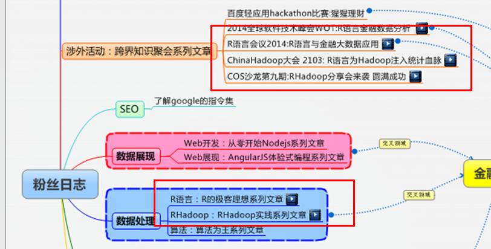

只要你找到相应的系列文章目录，比如是[R的极客理想系列文章](http://blog.fens.me/series-r/)，看到有这种提示的，就是有视频了！

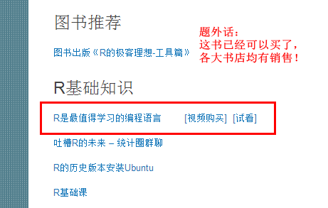

你可以点击“试看”，直接跳转到播放页面试看，视频都可以试看5分钟，也可以购买，在这儿我就不截图了哈！

视频购买，请认准[**“尚书视频”淘宝店铺**](http://shop112031231.taobao.com/shop/view_shop.htm)！尚书视频，制作精良，正品发售，买视频还送相关课件呦~~~（哈哈，把自己也给恶心了一把，让我自己一边儿吐会儿去！）

店里的所有视频，都可以通过“[淘宝同学](http://i.xue.taobao.com/list.htm?q=%C9%D0%CA%E9%CA%D3%C6%B5)”试看（5分钟），一经购买，一年内可以反复在线观看，看多少次没限制呦亲~

什么什么，你说我插播广告？！！！我就播广告了怎么着！我费劲巴拉的写了这么半天，这么多字儿，有图有真相的，都没人给稿费，我不就是见缝插针的想播个广告么，容易么我！

咳咳，言归正传、话接前言！咱们还是接着来说[粉丝日志](http://blog.fens.me/)吧！

### 4.金融跨界

好吧，让我们再来看看那张思维导图吧！

上图中，所有跟“金融跨界”那个框框有线条连接的，都与金融跨界有关。

其中，左边三个色块：数据展现、数据处理、数据库，与金融跨界属于交叉领域，如果往金融跨界，这三个部分，或多或少都会涉及。

接着，看这三个色块的上面，[跨界知识聚会系列文章](http://blog.fens.me/series-meeting/)部分。

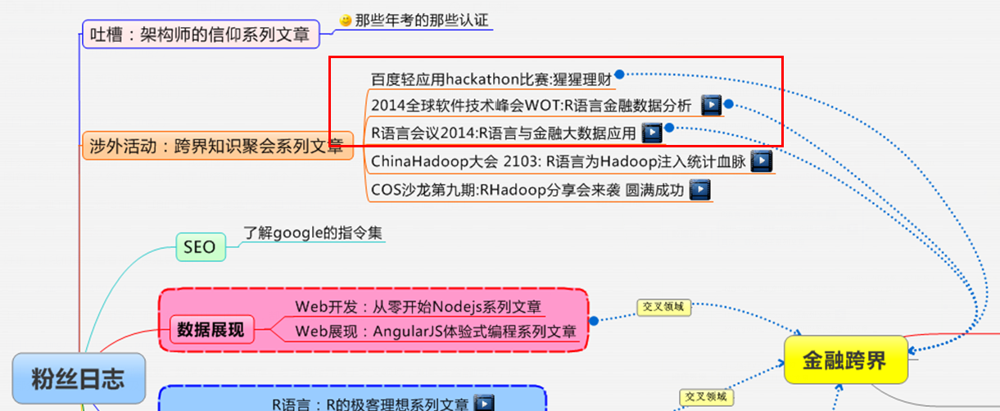

图中，[跨界知识聚会系列文章](http://blog.fens.me/series-meeting/)中，有三篇博文是属于金融跨界项目的，另外两篇，则是属于其他技术领域的跨界。

> 相关文章：
> 
- [百度轻应用hackathon比赛:猩猩理财](http://blog.fens.me/competition-hackathon-20140802/)
- [2014全球软件技术峰会WOT:R语言金融数据分析](http://blog.fens.me/meeting-wot-20140726/)
- [R语言会议2014:R语言与金融大数据应用](http://blog.fens.me/meeting-r-20140525/) 

接着，看思维导图的右边，[用IT技术玩儿金融系列文章](http://blog.fens.me/series-it-finance/)部分。

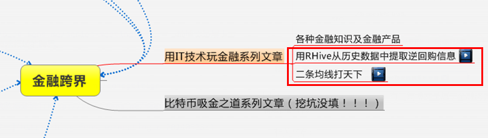

图中，[用IT技术玩儿金融系列文章](http://blog.fens.me/series-it-finance/)中，有两篇博文是属于金融跨界项目的，其余文章，都是各种金融知识的介绍。

> 相关文章：
> 
- [用RHive从历史数据中提取逆回购信息](http://blog.fens.me/finance-rhive-repurchase/)
- [二条均线打天下](http://blog.fens.me/finance-stock-ma/)

## 二、如何搜索

前面，我罗里吧嗦的说了一堆，都是说怎么系统的学习的，现在说说在学习、工作中遇到了问题，怎么快速有效的找到相应的文章解决！

其实，很简单，用搜索引擎呗！

在这里我要特别强调，用Google，别用Baidu！！！

道理很简单，比如说你Hive安装时出现了问题，那么，我们就用“hive安装”作为关键词进行搜索。Google搜索结果是这样的

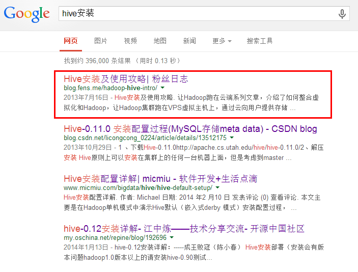

结果中，第一个就是[粉丝日志](http://blog.fens.me/)中的相关文章。

要是换成Baidu搜索呢？

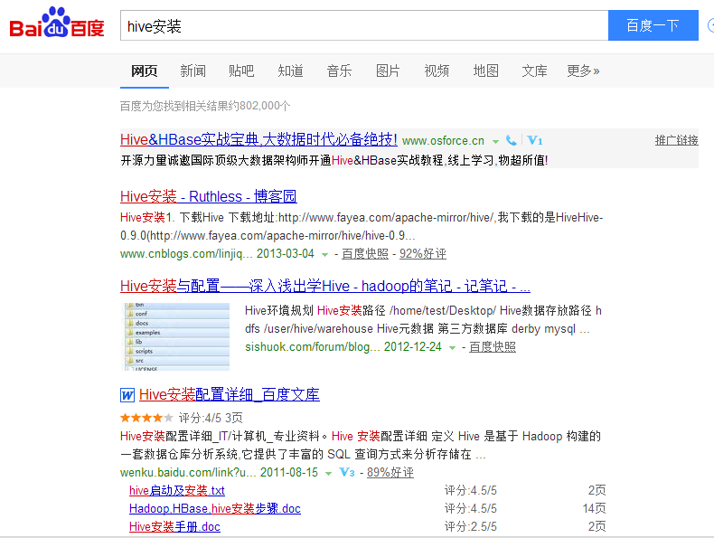

额~~~~第一页，压根儿就没看到[粉丝日志](http://blog.fens.me/)的影子好么！！！

### 其实，Google搜索还有一些技巧，也许你都不知道！！！

同样以“hive安装”为关键词，搜索栏中输入“site:blog.fens.me hive安装”，看看结果吧！

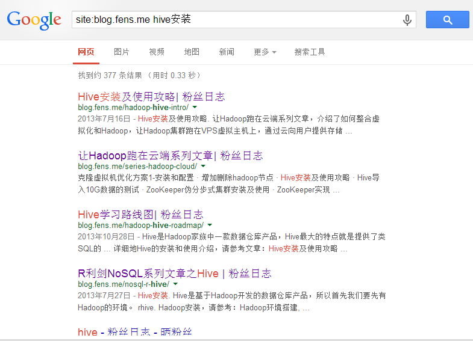

出来的结果，都是[粉丝日志](http://blog.fens.me/)内的相关文章哟！如何，是不是节省了不少的时间呢？！

你问我为什么，一言以蔽之，请看：[了解google的指令集](http://blog.fens.me/google-command/)，这篇文章中，还涉及了一些Google搜索的其他技巧，推荐大家看看！ 

> 相关文章：
> [了解google的指令集](http://blog.fens.me/google-command/)

## 三、提问与留言

学习和工作应该当中，肯定会有很多问题，提问和留言的方式，我也帮大家总结了下，基本有下面三个方式，大家可以根据喜好和习惯自行选择：

### 1.博客留言

大家可以在[粉丝日志](http://blog.fens.me/)相应文章或者[尚书官网](http://onbook.me/)（http://onbook.me/）下面的留言栏里面留言。别问我“那个留言栏怎么弄啊，我不会啊！”什么什么的，我鄙视你！要是这个都弄不明白，还能学点儿什么！

### 2.QQ群留言

没错，俺们已经建群了，大家可以在群里给张丹老师提问、留言，也可以跟其他朋友讨论。如果在群里给张丹老师留言的话，请在你留言的内容后面加上“@量化-张丹”的字样，张老师看到就会及时回复的。

> QQ群：尚书视频  383275651

### 3.邮件联系

如果是问题描述比较麻烦要发附件，或者是不：方便公开，那么，我建议你发邮件吧！工作上的事儿也请邮件联系！

> 联系卡片：
> 
- 张丹(Conan), 程序员Java,R,PHP,Javascript
- weibo：@Conan_Z
- blog: http://blog.fens.me
- email: bsspirit@gmail.com

