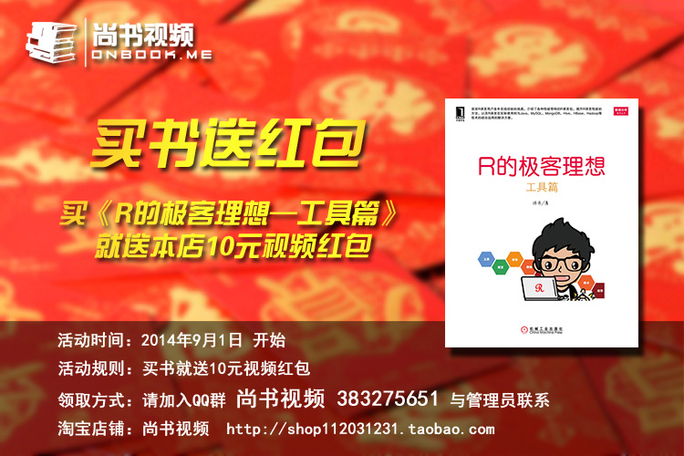
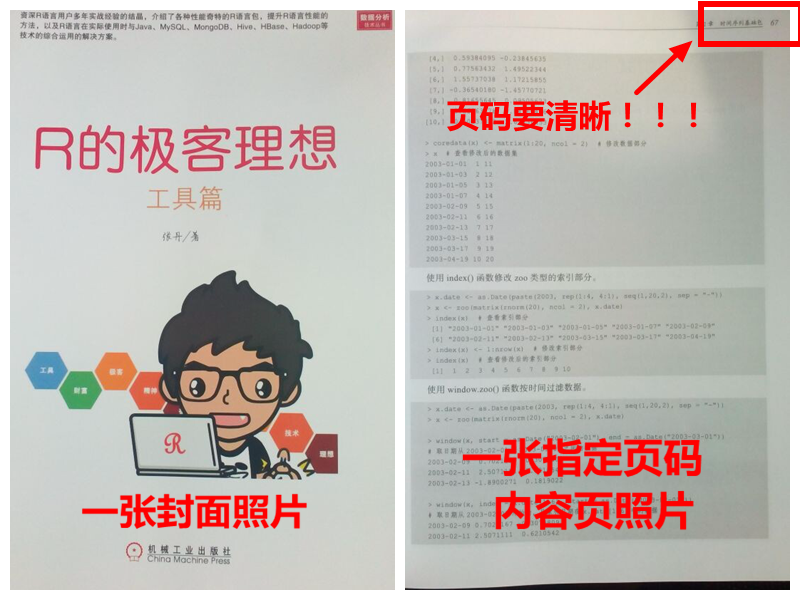

买书送红包活动细则
==============

亲们，福利大放送啦！！！

即日起，凡购买《R的极客理想—工具篇》正版图书的朋友们，都可领取10元视频红包。

## 一、活动规则

- 活动时间：2014年9月1日 活动开始
- 活动规则：不管您是通过什么购买途径，（网上书店、实体书店都可以），只要购买了《R的极客理想—工具篇》正版图书，即可凭书领红包，每人可领10元视频红包。

## 二、领红包流程

- 第一步：加入QQ群（**尚书视频：383275651**）
- 第二步：联系群内管理员，并写上 **“领红包 @助理-管理员”** 字样
- 第三步：按管理员要求，拍 **两张** 照片（一张图书封面照片，一张管理员指定本书页码的照片）

- 第四步：向管理员提供自己的 **支付宝账户名**（支付宝账户名是Email地址或者手机号码），管理员会将红包发到您的支付宝账户内。

## 三、红包使用说明

- 红包面额：10元
- 红包有效期：7天 （从红包发出之日计算）
- 使用范围：[**尚书视频**淘宝店铺](http://shop112031231.taobao.com/) 通用，直接当现金用，不是满***元才能用的那种鸡肋！
- 如何使用：先拍下宝贝，结算的时候记得选择**红包**结算！

> 注：如果您在红包领取、视频购买方面还有什么问题，请咨询群内管理员。

店内各种教学视频，会持续更新，敬请关注！

助理—管理员：盗版猪妖

尚书视频  http://shop112031231.taobao.com/

2014年8月31日

